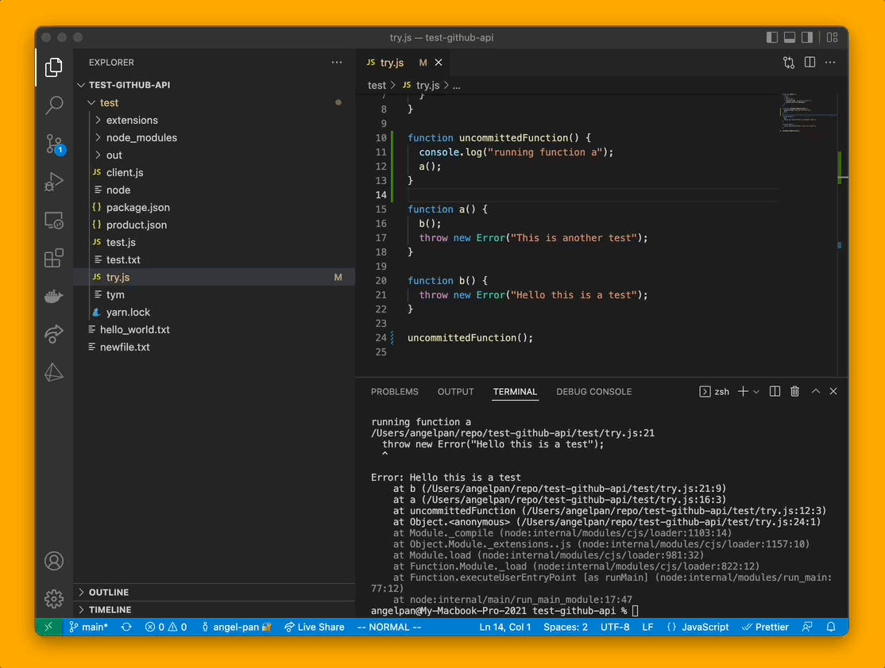
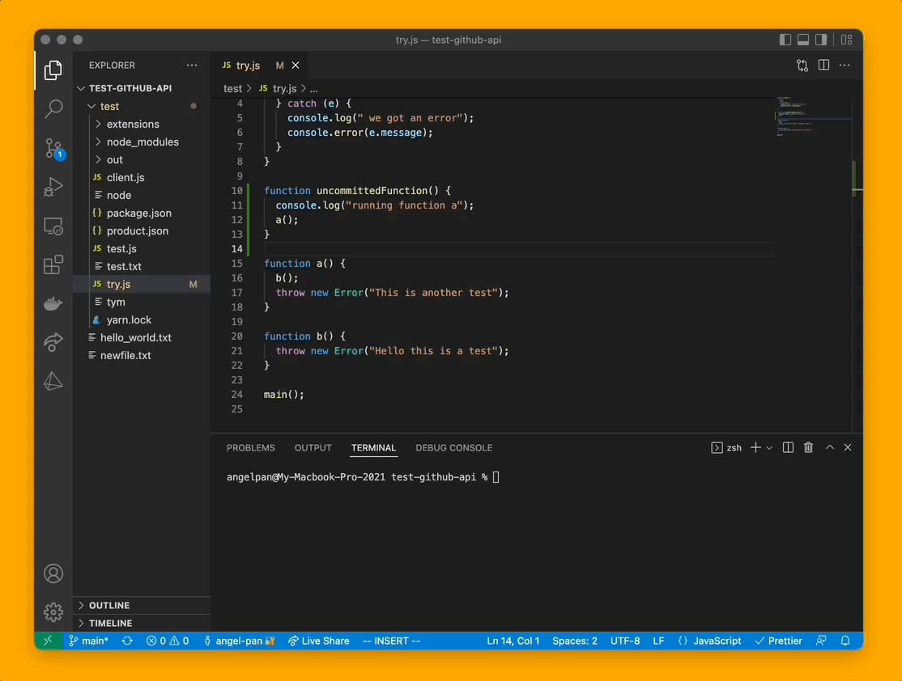
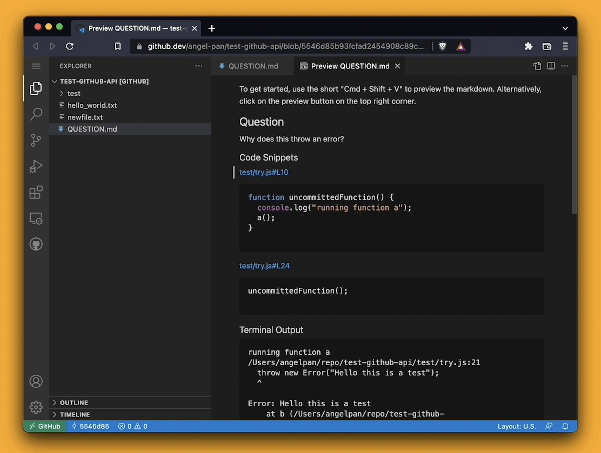

# Share your code context in one click.

Right click on a snippet of code and get a sharable GitHub link to it!

Tym extension allows you to quickly share code snippets with your teammates by right clicking on the code and selecting "Add Snippet to question." Your teammates can then view the code in a web-based version of VS Code, making it easy for them to browse your code, even if you have uncommitted changes.

# 🚀 How it works

### 🙋 Ask a question with a [github.dev](http://github.dev) link

1. Select a snippet of code
2. Select `add snippet to quesiton` to question from the right-click menu (or press “⌘ + .”)
3. Add a question or terminal dump if you like
4. Click done and share the link with your teammates!

### Or just get a URL for a code snippet

→ Right click on a snippet and `click get a github link`  (or press “⌘ + .”)

## 👀 What does my teammate see?

They see your question and code snippets in a web-vscode and can easily browse your code! (even if you have uncommitted changes)

## 🔒 **Security**

Our servers have no access to your code but we store the question, highlighted code snippets, and terminal dump. Our extension just commits your current code to your repo with a hidden git ref. So only people who have access to your Github repository can open the link. Learn more [here](https://tym-inc.notion.site/Committing-without-REALLY-committing-0f94a5252a104937b1dade1af6fc36b4).